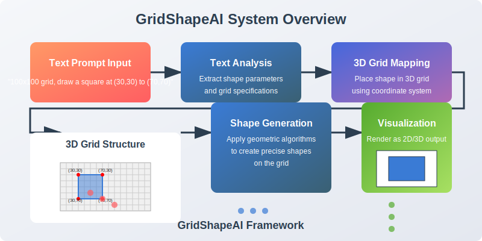
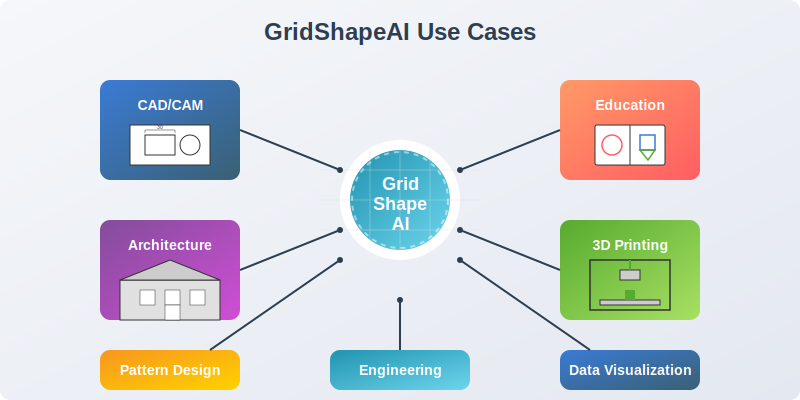

# GridShapeAI

An AI system for generating precise geometric shapes from text prompts using a grid-based approach.

## Overview

GridShapeAI is an innovative artificial intelligence system that generates precise geometric shapes from natural language text prompts. Unlike conventional text-to-image models that excel at artistic content but struggle with geometric precision, GridShapeAI leverages a 3D grid structure to create highly accurate shapes with coordinate-level precision.

The system utilizes a specialized encoder-decoder neural network architecture that processes text descriptions and maps them to points in a 3D grid space (typically 100×100×100), resulting in one million possible points for precise shape representation.

## Key Features

- **Text-to-Shape Generation**: Create precise geometric shapes using natural language descriptions
- **High Precision**: Pixel-level accuracy through grid-based coordinate system
- **3D Capability**: Generate both 2D and 3D shapes within the same framework
- **Computational Efficiency**: Uses ~10M parameters vs. billions in standard text-to-image models
- **Pattern Generation**: Create repeating patterns and complex geometric arrangements
- **Dynamic Parameters**: Adjust shape properties in real-time through parameterized descriptions
- **Reverse Mapping**: Extract coordinate data, meshes, UV maps, and point clouds from generated shapes
- **Multi-domain Integration**: Combine principles from different domains (e.g., fluid dynamics, structural engineering)

## System Architecture

The GridShapeAI system consists of the following components:

1. **Input Processing Module**: Parses and analyzes text prompts using NLP techniques
2. **3D Grid Generation Module**: Creates and manages the 3D coordinate grid structure
3. **AI Model**: Encoder-decoder neural network that maps text to grid coordinates
4. **Shape Generation Engine**: Converts grid coordinates to actual geometric shapes
5. **Rendering Pipeline**: Transforms internal representations to visual output
6. **Reverse Mapping Module**: Extracts structured data from generated shapes

## Workflow

The system follows a multi-stage process to generate shapes:

1. **Text Prompt Analysis**: Extract key information from the prompt (shape type, dimensions, coordinates)
2. **3D Grid Mapping**: Map the analyzed information to the 3D grid structure
3. **Point Selection**: Identify grid points that form the shape
4. **Surface Generation**: Create surfaces between selected points when needed
5. **Rendering**: Convert the 3D grid structure to a 2D visualization
6. **Reverse Mapping** (optional): Extract coordinate data or other representations

## Use Cases

GridShapeAI can be applied in various domains:

- **CAD/CAM**: Generate initial designs through natural language
- **Architecture**: Create building components with precise specifications
- **Education**: Teach geometric concepts through interactive shape generation
- **3D Printing**: Generate models ready for fabrication
- **Pattern Design**: Create complex repeating patterns for textiles or graphics
- **Engineering**: Design components with specific geometric constraints
- **Data Visualization**: Generate precise charts and diagrams

## Getting Started

See our [Installation Guide](doc/installation.md) and [Usage Tutorial](doc/usage.md) to get started with GridShapeAI.

Try our interactive demo in the [simulation environment](deployment/simulation/README.md).

## Technical Implementation

The system is implemented using:

- Python for core algorithms and logic
- PyTorch for neural network implementation
- NumPy for grid operations and geometry calculations
- OpenGL for rendering and visualization

For detailed technical information, see the [src directory](src/README.md).

## Core Components

- **[Grid Module](src/grid)**: 3D grid representation and operations
- **[Model Module](src/model)**: Neural network implementation for text-to-grid generation
- **[Shape Generator](src/shape_generator)**: Core algorithms for geometric shape creation
- **[Renderer](src/renderer)**: Visualization of generated shapes in 2D and 3D
- **[Reverse Mapper](src/reverse_mapper)**: Conversion to meshes, point clouds, and UV maps
- **[Utilities](src/utils)**: Helper functions and text processing

Patent Pending